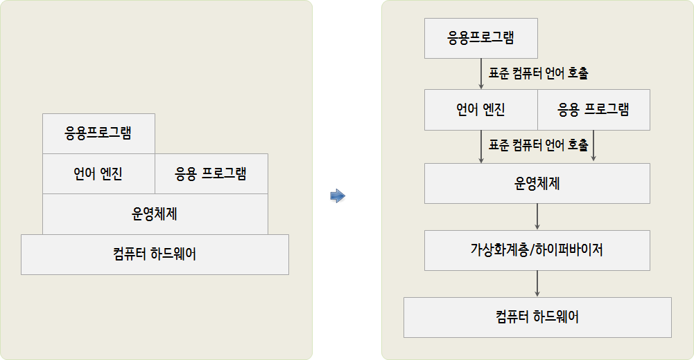
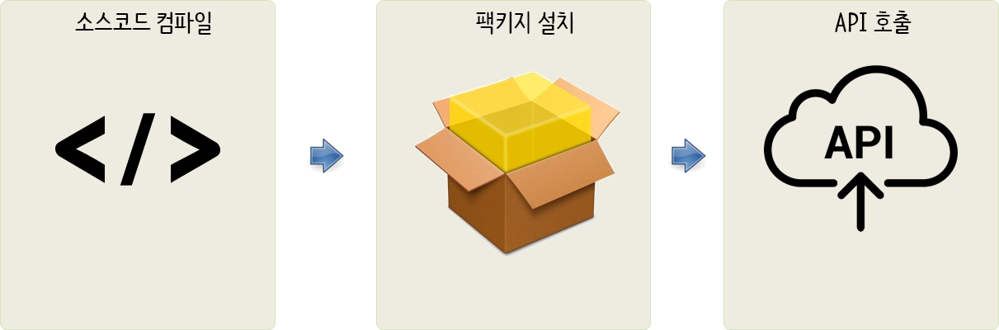
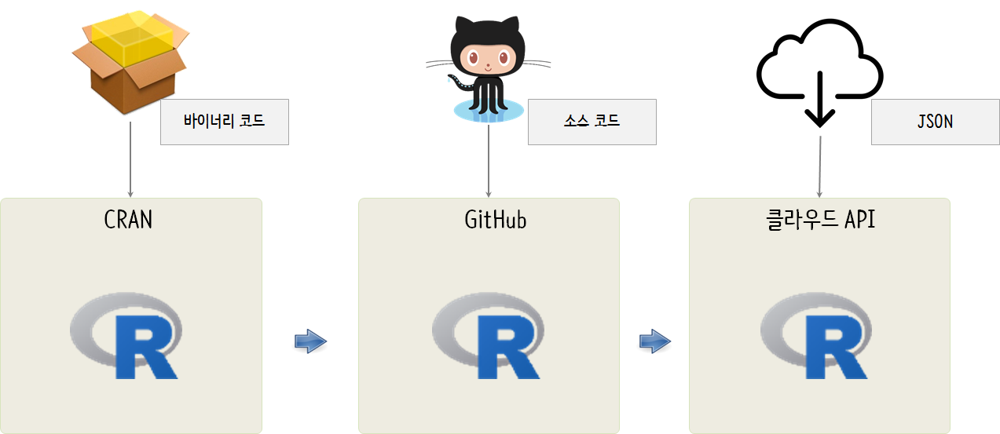

```{r setOptions, message=FALSE, include=FALSE}
source("tools/chunk-options.R")
knitr::opts_chunk$set(echo = TRUE, warning=FALSE, message=FALSE)
```

# 소프트웨어 진화 {#software-evolution}

가정과 사무실에 비치된 데스크톱 컴퓨터처럼 오늘날 컴퓨터 시스템은 다음 그림처럼 생겼다.

지난 30~40년에 걸쳐 컴퓨팅은 엄청나게 변했다. 
옛날에는 프로그래머 한명이 단일 프로세서에서 돌아가는 프로그램을 하나 작성했다. 
그 시절에, 모든 비트의 기능이 컴퓨터 프로세서의 희귀 시간과 공간 자원을 차지해서 구현되었다. 
오늘날, 프로세서는 더 커지고 더 빨라졌고, 많은 프로그램을 한번에 처리할 수 있다. 
그래서 컴퓨팅이 더 모듈화 되었다.



운영체제가 컴퓨터 “교통경찰” 역할을 자임하고 있다. 
운영체제는 어느 프로그램을 실행할지, 어느 프로그램이 실행되고 있는지 추적하고, 프로그램 사이에 우선순위를 부여하고, 
프로그램과 현실세계(키보드, 컴퓨터 화면, 프린터 처럼) 사이를 중재한다.

계층별 구성요소가 의사소통하는 방법이 중요할 수 있다. 
예를 들어, 단지 운영체제만 하드웨와 “대화”하는 것을 볼 수 있다. 
이것이 일반적인 접근방법인데 이유는 의사소통 수단(하드웨어와 하드웨어가 의사소통하는 방식)이 특정 물리적 컴퓨터마다 다양하기 때문이다. 
따라서, 운영체제는 특정 하드웨어 플랫폼에 동작되도록 제작되어야 된다. 
하지만, 응용프로그램 개발자는 모든 컴퓨터에서 돌아가도록 다른 버젼의 응용프로그램을 작성하고 싶지 않다고 가정하자. 
대신에, 개발자는 가장 적은 버젼의 응용프로그램을 작성하면서도 많은 컴퓨팅 사용자 고객에 다가 가고자 한다.
개발자는 이러한 목표를 **추상화(abstraction)**라는 개념을 사용해서 달성하는데, 
이 개념이 현대 컴퓨팅에 있어 핵심이다. 
만약 운영체제(예를 들어, 윈도우즈, 리눅스, iOS) 설계자가 운영체제 명세서나 운영체제를 사용하는 필요한 API를 제공하고 나면, 
개발자는 해당 플랫폼에 대해 프로그램을 한번만 작성하면 된다. 
이를 위해서, 운영체제 공급업체는 표준 시스템 호출 집합을 사용하거나 해당 운영체제에 대한 API를 사용한다. 
예를 들어, 모니터 화면에 그래픽을 표시하는 API, 파일을 프린터로 전송하는 API, 키보드에서 입력을 얻는 API가 운영체제 API에 포함될 수 있다. 
만약 프로그래머가 해당 API에 대한 구문과 규칙을 따른다면, 그렇게 작성된 프로그램은 해당 API를 사용하는 어떤 운영체제에서도 돌아간다.

추상계층을 생성하는 방식은 표준화뿐만 아니라 보안도 증진시킨다. 
응용프로그램 프로그래머는 다른 프로그램에서 사용하는 메모리를 덮어 쓴다거나, 
화면에 맞지 않는 그림을 그리도록 명령을 전송하는 등 오래전에 했던 것을 하지말아야 된다. 
프로그램이 동작하는 범위와 권한을 줄이는 것을 때때로 **캡슐화(Encapsulation)**라고 부른다. 
캡슐화는 프로그램이 특정 운영체제와 호환이 되도록 명확히 규정하고, 기술적인 문제를 일으키지 않고 프로그램이 수행할 수 있는 것에 대한 한계도 정의한다.

최근 CPU 코어 숫자도 늘어나고 다수 컴퓨터도 분산되어 처리 능력이 비약적으로 늘어남에 따라 컴푸터 하드웨어와 운영체제 사이에 
가상화 계층/하이퍼바이저(hypervisor)를 넣어 추상화하는 것도 동일한 맥락이다.



# 응용프로그램의 진화 {#application-evolution}

컴퓨터는 복잡한 연산작업을 중앙처리장치 혹은 그래픽 처리장치가 초당 수십억번 수행할 수 있는 매우 작은 단계로 연산작업을 쪼개서 수행한다. 
1 바이트를 4바이트로 기억장치 특정 장소에서 다른 장소로 이동, 단순한 사칙연산 수행, 실행할 다음 단계를 선택하는 작업(디폴트 기본설정 혹은 테스트 결과에 따라)이 이러한 연산작업에 포함된다. 
각 연산작업은 매우 단순하지만, 아주 많은 연산작업을 수행함으로써, 컴퓨터는 사람이 인지할 수 있는 행동을 취할 수 있다 
- 예를 들어, 화면에 메시지 출력. 

컴퓨터가 이해할 수 있는 단순한 명령은 너무 작은 조각이라 사람이 쉽게 이해하고 조직화할 수 없다. 
그래서, 컴퓨터 과학자가 컴퓨터 프로그램을 작성하는데 사용되는 컴퓨터 언어를 개발해서 사람이 더 쉽게 처리할 수 있게 했다. 
이것이 소위 **프로그래밍 언어(Programming Language)**다. 프로그래밍 언어 각 문장이 다수 컴퓨터 명령으로 번역된다.

기본적으로 개발자는 프로그램을 소스코드로 표현한다. 
컴퓨터는 소스코드를 컴파일(Compilation)과 해석(interpretation)으로 불리는 과정을 거쳐 실행될 수 있는 무언가로 번역한다. 
예를 들어, 대부분의 C 프로그램은 CPU로 직접 실행될 수 있는 이진코드로 컴파일된다. 
자바와 마이크로소프트 C샾으로 작성된 프로그램은 바이트 코드(byte code)로 불리는 중간 이진표현으로 번역되고, 
가상 컴퓨터(Virtual Machine)으로 불리는 컴퓨터 프로그램에 의해서 실행되는 이진코드로 전환된다.

컴퓨터가 더 느렸을 때, 프로그램을 소스코드에서 실행가능 형태로 전환하는 시간은 측정가능했고, 
이를 위해서 사용자의 프로그램 사용을 방해하거나 늦췄다. 지난 수십년에 걸쳐, CPU는 훨씬 빨라졌다. 
처리가 더 빨라짐에 따라, 더 많은 연산작업이 메인 프로그램에서 라이브러리로 옮겨졌다. 예를 들어, 애플 II 시절에 개발자가 코드를 작성하려고 하면 이미지를 화면 주위로 옮겨야 했다. 
오늘날, 소스코드 한줄로 웹브라우져에서 이미지 애니메이션 기능을 구현하는 방법은 수도 없이 많다.

이와 같은 발전으로, 코드가 점차 소스코드 형태로 배포된다. 
예를 들어, 웹브라우져에 HTML과 자바스크립트를 적재되면, 
웹브라우져가 웹페이지를 화면에 출력하고, 입력값을 검사하고, 페이지 콘텐츠에 애니메이션할 수 있는 실행가능한 코드로 HTML과 자바스크립트를 변환한다. 
오늘날 일반적인 웹페이지는 수십년 전 컴퓨터 전체 메모리에 넣을 수는 것보다 많은 코드를 담고 있다.

현실 세계에서 특정 프로그램 해당 코드를 반복해서 사용할 필요가 있을 수 있고, 
개발자는 한번만 코드를 작성하고자 한다. 이 지점에서 **빌딩(building)**과 **패키징(packaging)** 개념이 추가되는 입구가 된다.

예를 들어, 오늘날 거의 어떤 프로그래머도 제곱근을 찾아내는 루틴(routine)을 작성하고 싶지 않는데 
이유는 이미 누군가 그런 루틴(Rountine)을 작성했기 때문이다. 
그래서, 현실 세계에서 프로그래머로 하여금 기존에 존재하던 루틴을 재사용해서 프로그램을 빌드해서 만들어내는 기법이 있다. 
기존에 존재하던 제곱근 루틴은 이미 테스트되어 검증되었고, 따라서 맨땅에서 새로 개발된 것보다 신뢰성이 더 높다. 
이렇게 기존에 존재하는 코드 루틴을 흔히 **라이브러리(library)**라고 부른다. 
라이브러리는 법률서류(legal restatement)와 유사하다. 
~~마치 변호사가 기본 판례를 지칭하기보다 법률서류에 있는 특정 부분을 참조하듯이, 프로그래머는 라이브러리 루틴을 사용해서 잘 정의된 일반적인 연산작업을 수행한다.~~

프로그래머가 프로그램을 만들때, 먼저 소스코드 형태로 코드를 작성하고 **컴파일(compile)**해서 목적코드형태로 전환시킨다. 
그리고 나서, **링커(linker)**로 불리는 프로그램을 사용해서 작성한 목적코드를 라이브러리 루틴의 다른 목적코드와 연결시킨다. 
만약 이 작업을 수행되면, 프로그래머는 굳이 라이브러리 소스코드가 필요하지 않다. 
잘 작성된 라이브러리는 대체로 프로그래머에 대해 **블랙박스(black box)**다. 
즉, 프로그래머는 블랙박스 안으로 들어가는 것과 나오는 것(코드를 엮는데 필요한 정보)을 제외하고 박스내부에 무엇이 있는지 알 필요가 없다. 
이 정보를 인터페이스 정의(interface definition) 혹은 **응용프로그램 인터페이스(API, Application Program Interface)**라고 부른다.

<style>
div.blue { background-color:#e6f0ff; border-radius: 5px; padding: 10px;}
</style>

<div class = "blue">
목적코드가 모두 엮기게 되면, 이것을 실행가능 프로그램(executable program)이라고 부른다. 
실행가능 프로그램은 실행하는데 필요한 모든 조각을 갖추고 있다.
단, 소스코드 없이 버그 수정을 할 수 없다. 
소스코드 없이 변경 혹은 개선을 할 수 없다. 
목적코드로 할 수 있는 전부는 좀더 큰 프로그램에 넣어 만드는 것 뿐이고, 실행가능 파일을 가지고 할 수 있는 모든 것은 실행하는 것 뿐이다.
</div>


# 데이터 과학 R 언어 {#r-language}

데이터 과학을 위해서 최근도 [CRAN](cran.r-project.org/web/packages/)을 통해서 팩키지를 설치하고 데이터 과학을 수행하는 방법이 
일반적이었지만, 최근에는 [github.com](https://github.com/)을 통해서 개발중인 최신 소스코드를 다운로드 받아 설치하여 활용하는 방법이 
강력한 방법으로 부상하고 있다. 더불어 트위터, 페이스북, AWS, 애저, 구글 등에서 인공지능을 중심으로 다양하고 유용한 API를 제공하고 있어 
이를 바탕으로 데이터 과학을 수행하는 방식도 부상하고 있다.

