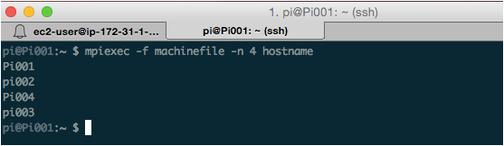
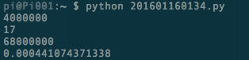
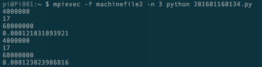
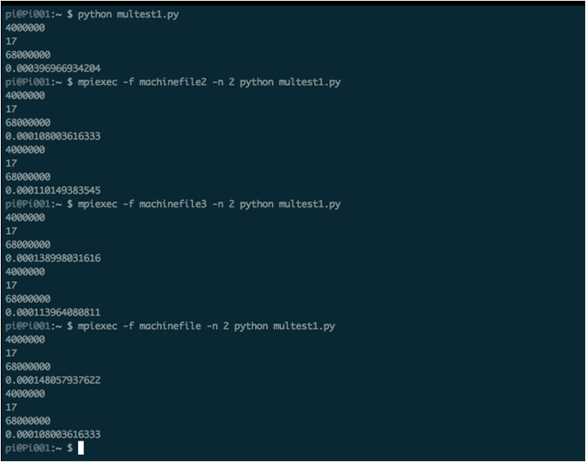
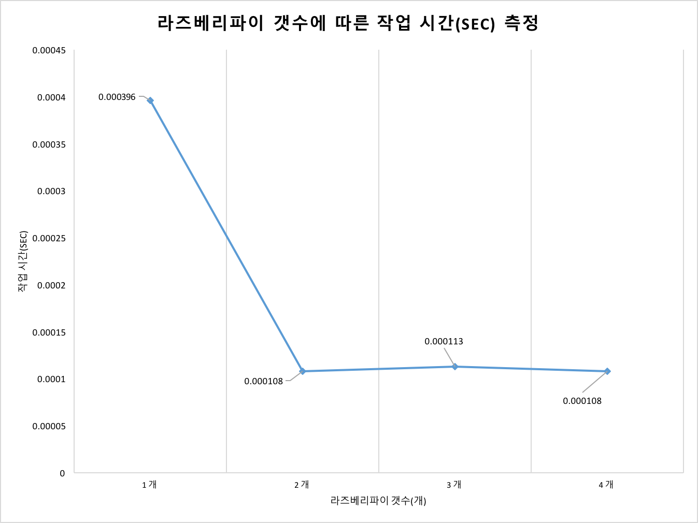
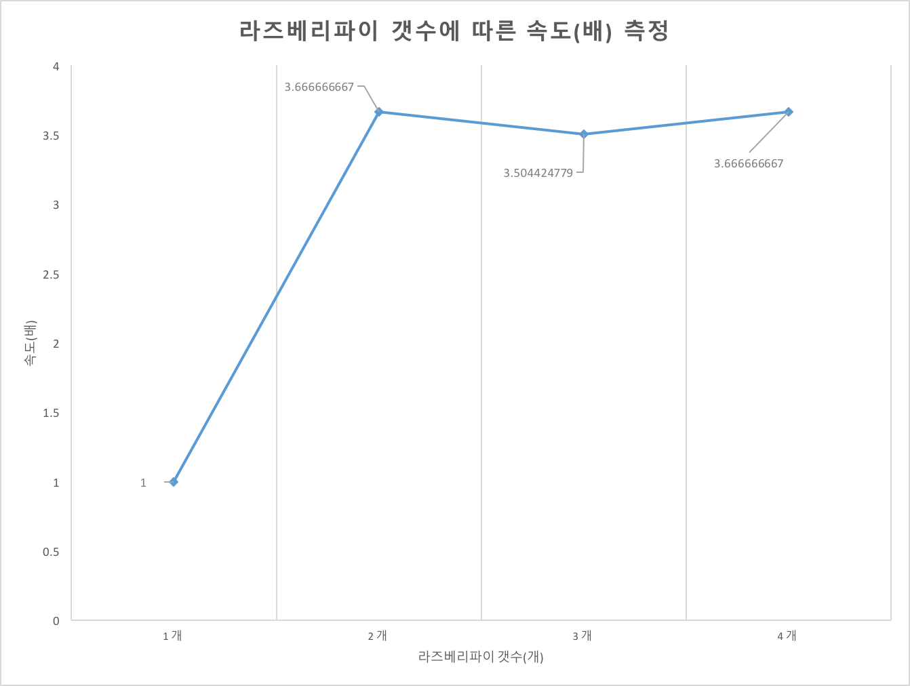

간단한 파이썬 코드를 통해 라즈베리파이 클러스터 MPI 테스트를 실시한다.

### MPI 연결상태 확인 및 테스트 준비

먼저, MPI 확인을 위해 서버로 작동하는 pi01에 ssh 접속한다.

- 모든 라즈베리파이의 MPI(병렬)연결을 확인한다.

~~~ {.python}
$ mpiexec -f machinefile -n 4 hostname
~~~

`machinefile` 에 기록된 ip에 대해 `hostname` 을 4개 출력하는 명령어.
모든 라즈베리파이가 정상적으로 연결되었다면 모든 라즈베리파이의 `hostname` 이 아래 사진과 같이 출력된다.

- 테스트용 파이썬파일(example.py)를 만든다.

~~~ {.python}
$ nano example.py
~~~

~~~ {.output}
# example.py 파이썬 코드
import timeit
start = timeit.default_timer()
a=4000000
print a
b=12+5
print b
c=b*a
print c
stop = timeit.default_timer()
print stop - start
~~~

`timeit` 라이브러리를 가져와서 작업의 시작과 끝 사이 걸린시간을 출력함으로써 라즈베리파이 클러스터 갯수에 따른 출력 시간을 관측할 수 있다.

- 파이썬파일(example.py)을 모든 라즈베리파이에 복사한다.

~~~ {.python}
$ scp -r example.py 192.168.1.?:/home/pi
~~~

여기서 `192.168.1.?` 은 서버pi에 존재하는 `example.py` 을 복사하고자 하는 라즈베리파이의 ip이다.
해당 라즈베리파이의 `/home/pi` 디렉토리로 파일을 복사한다.

### python 테스트 결과

- 파이썬 동작에 한 개의 라즈베리파이만 사용.

~~~ {.python}
$ python example.py
~~~

- 파이썬 동작에 라즈베리파이 두대 사용.

~~~ {.python}
$ mpiexec -f machinefile2 -n 2 python example.py
~~~

ip가 두개만 기록된 `machinefile2` 에 대해 세번의 결과를 출력한다.

- 파이썬 동작에 세 개, 네 개의 라즈베리파이 사용.

~~~ {.python}
$ mpiexec -f machinefile3 -n 2 python example.py
$ mpiexec -f machinefile -n 2 python example.py
~~~

### 파이썬 테스트 결과 분석

- 라즈베리파이 갯수에 따른 작업 시간(sec)

- 라즈베리파이 갯수에 따른 작업 속도(배)

- 확인된 사항

    + 한대와 두대로 파이썬코드를 동작시켰을 떄는 테스트 시간감축이 확인되었지만, 3대부터는 비슷한 동작 시간을 출력하는 한계점이 발견되었다.
    + 해당 파이썬 샘플이 2대 이상의 라즈베리파이 클러스터에서는 차이점을 출력하지 못했으므로 라즈베리파이 갯수 증가에 따른 객관적 성능출력이 필요하다.