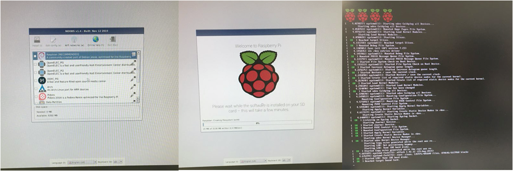
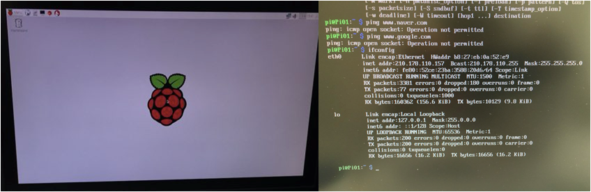
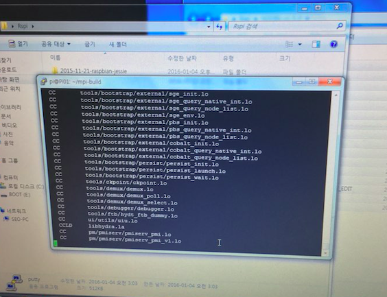
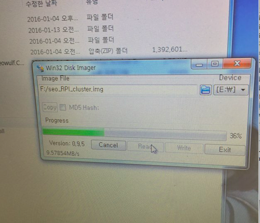
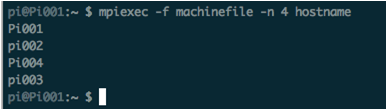
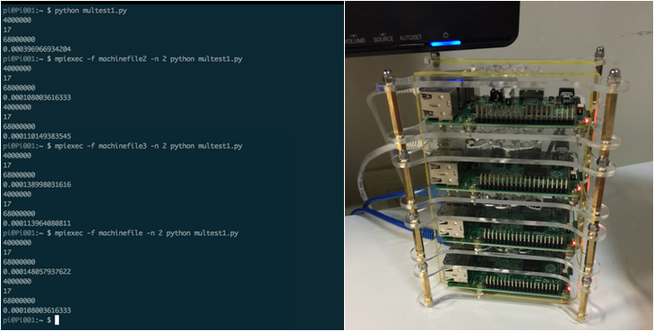

## 오픈 슈퍼 컴퓨터 제작과정

### 1. 개별 라즈베리파이 기본설치

1. 라즈비언 운영체제(raspbian OS) [다운로드](https://www.raspberrypi.org/downloads/raspbian)

2. diskimager [다운로드](http://sourceforge.net/projects/win32diskimager/files/?source=navbar) : `raspbian.img` 이미지를 마이크로SD 카드에 굽는다.

3. 라즈비언 운영체제를 설치한 마이크로SD 카드를 라즈베리파이 삽입하여 환경설정 작업을 마무리한다.

* 라즈베리파이 OS 설치 사진 (설치프로그램선택, OS설치 화면, 시작화면)

### 2. 라즈베리파이 클러스터 구축을 위한 기본설치

* 라즈베리파이 기본화면 사진 (그래픽 사용자 인터페이스, 명령-라인 인터페이스)

`sudo raspi-config` 명령어를 통해 `hostname`을 변경한다.

1. 설정변경
    - setup option 1번
    - setup option 7번: modest(800MHz)
    - setup option 8번
         + hostname 변경: ex) pi01
         + memory split: 64 -> 16
         + SSH: enable
    - Finish : 재부팅하기
         + 사용자 아이디: pi
         + 사용자 비밀번호: raspberry

2. **동일 인터넷망** 에서 라즈베리파이 접속

    - 윈도우: `putty` 를 통해 ip 주소로 접속
    - 리눅스 계열: 터미널에서 `ssh pi@IPADDRESS` 로 접속

3. 클러스터링을 위한 `MPICH` 설정하는 작업 [^MPICH]

~~~ {.python}
$ sudo apt-get update
$ mkdir mpich2
$ cd ~/mpich2
$ wget http://www.mpich.org/static/downloads/3.1/mpich-3.1.tar.gz
$ tar xfz mpich-3.1.tar.gz
$ sudo mkdir /home/rpimpi/
$ sudo mkdir /home/rpimpi/mpi-install
$ mkdir /home/pi/mpi-build
$ cd /home/pi/mpi-build
$ sudo apt-get install gfortran
$ sudo /home/pi/mpich2/mpich-3.1/configure -prefix=/home/rpimpi/mpi-install
$ sudo make
$ sudo make install
$ cd ..
$ nano .bashrc
$ sudo reboot
~~~

`.bashrc` 파일에 맨아랫줄에 `PATH=$PATH:/home/rpimpi/mpi-install/bin` 추가
외부에서 접속이 끊길 경우 `sudo reboot` 명령어로 재접속.

[^MPICH]: [MPICH](https://www.mpich.org/)는 메시지 전달 인터페이스(Message Passing Interface, MPI) 표준을 구현한 것으로,  MPI는 1990년대 초에 40개 조직들의 토론에 의해 태어났다. 초기에는 ARPA 및 미국 국립과학재단(NSF)에 의해 주도 되었다. 아주 처음부터 새롭게 시작하는 것 대신에 MPI는 상용 시스템에서 사용되는 기능들 위에서 설계되었다. MPI 규격은 규격 보충으로 증가 되었으며 MPI는 일반적으로 TCP/IP 와 소켓 연결을 사용한다. MPI는 지금 광범위하게 사용되는 통신 모델이며 C, 포트란, Python과 같은 언어를 사용하여 병렬 프로그래밍을 구현한다(출처: [위키피디어](https://ko.wikipedia.org/wiki/컴퓨터_클러스터)).

4. MPICH를 통해 파이썬코드가 동작하도록 설정하는 작업

~~~ {.python}
$ sudo aptitude install python-dev
$ wget https://mpi4py.googlecode.com/files/mpi4py-1.3.1.tar.gz
$ tar -zxf mpi4py-1.3.1.tar.gz
$ cd mpi4py-1.3.1
$ python setup.py build
$ sudo python setup.py install
$ export PYTHONPATH=/home/pi/mpi4py-1.3.1
$ mpiexec -n 5 python demo/helloworld.py # 파이썬코드가 MPICH로 동작하는지 테스트하는 코드
~~~

### 3. 나머지 라즈베리파이에 반복설정을 생략하기 위한 작업

1. `.img`파일로 압축

상기 과정을 완료한 마이크로SD를 추출하여 `diskimager`를 통해 데스크탑에 `name.img`로 
`read` 명령어로 불러온다.

2. 나머지 라즈베리파이에 `write` 명령어로 굽는다.

### 4. 모든 라즈베리파이를 연동시키는 작업

1. 서버 마스터 역할을 부여하는 `nmap` 네트워킹 준비작업

    - 서버(허브)로 동작할 라즈베리파이(예를 들어, pi01)에 원격접속
    - `$ sudo apt-get update`
    - `$ sudo apt-get install nmap`
    - 연결된 모든 라즈베리파이들의 ip 적어두기
        + `$ sudo nmap -sn 192.168.1.*`

2. MPI 동작을 위해 ip 입력파일 만들기

~~~ {.python}
$ mkdir mpi_test
$ cd mpi_test
$ nano machinefile
~~~

`machinefile` 에 모든 ip를 기록해 둔다.

~~~ {.output}
192.168.1.101
192.168.1.102
192.168.1.103
192.168.1.104
~~~

3. 편의를 위해 모든 라즈베리파이 이름을 변경한다.

    - 각각의 라즈베리파이에 접속
        + `$ sudo raspi-config`
        + 8번: hostname: pi02 (다른것들은 pi03 pi04 ...)
        + finish
    - 다시 허브서버로 동작할 pi01에 접속

4. 비밀키(Private Keys)를 통해 모든 라즈베리파이 연동작업

로그인을 통해 각 라즈베리파이 컴퓨터에 접속하는 대신에 공개키와 비밀키를 사용해서 
각 라즈베리파이 컴퓨터간 접속을 자동화 한다.

- 허브서버 pi01 에 원격 접속
    + `$ssh-keygen`
    + `$cd ~`
    + `$cd .ssh`
    + `$cp id_rsa.pub pi01`
- 노드인 pi0? 에 원격 접속 (n번째 라즈베리파이를 pi0?로 표기함)
    + $ `ssh-keygen`
    + $ `cd .ssh`
    + $ `cp id_rsa.pub pi0?`
    + $ `scp 허브인PI01의IP:/home/pi/.ssh/pi01 .`
    + $ `cat pi01 >> authorized_keys`
    + $ `exit`
- 허브서버인 pi01 에서 나머지 모든 라즈베리파이를 수용하는 작업
    + $ `scp PI0?의IP:/home/pi/.ssh/pi0? .`
    + $ `cat pi0? >> authorized_keys`
- 라즈베리파이 클러스터 연결상태 테스트
    + `$ mpiexec -f machinefile -n 4 hostname` # (machinefile 의 hostname 4개 출력)

### 5. 연동완료된 라즈베리파이 클러스터 파이썬 테스트

- 샘플 파이썬 코드 작성

~~~ {.python}
$nano pythonexample.py 
a=400
print a
b=12+5
print b
c=b*a
print c
~~~

- 파이썬 코드를 모든 라즈베리파이에 복사
    + `$ scp -r pythonexample.py PI0?의IP:/home/pi`
- 클러스터에서 파이썬 코드 동작
    + `$ mpiexec -f machinefile -n 5 python pythonexample.py` #(machinefile 의 ip 들로 파이썬 코드 MPI 5번 출력)

### 참고 자료

- [Build a Compact 4 Node Raspberry Pi Cluster](http://makezine.com/projects/build-a-compact-4-node-raspberry-pi-cluster/)
- [Raspberry Pi B+ Cluster (Super Computer)](https://www.youtube.com/watch?v=JtX9lVDsqzg)[^rpi-youtube01] [^rpi-youtube02] [^rpi-youtube03] [^rpi-youtube04]
- [MAKE YOUR OWN CLUSTER COMPUTER (PART 1)](http://www.tinkernut.com/2014/04/make-cluster-computer/)
- [MAKE YOUR OWN CLUSTER COMPUTER (PART 2)](http://www.tinkernut.com/2014/05/make-cluster-computer-part-2/)

[^rpi-youtube01]: [Raspberry Pi B+ Cluster (Super Computer) Part 1](https://www.youtube.com/watch?v=JtX9lVDsqzg)
[^rpi-youtube02]: [Raspberry Pi B+ Cluster (Super Computer) Part 2](https://www.youtube.com/watch?v=vHJ4ZeXT_Zc)
[^rpi-youtube03]: [Raspberry Pi B+ Cluster (Super Computer) Part 3](https://www.youtube.com/watch?v=x3WIp3z218I)
[^rpi-youtube04]: [Raspberry Pi B+ Cluster (Super Computer) Part 4](https://www.youtube.com/watch?v=FGX2s8UMnIE)
